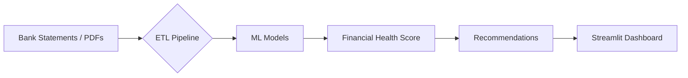

<div align="center">
  
</div>

<h1 align="center">Mifos Summer of Code 2025 — Phase II: Bank Statement Analysis & Real-Time Insights</h1>

<div align="center">
  
  
  
  
  <br><br>
  
  
  
  
</div>


# Mifos Summer of Code 2025 — Phase II: Bank Statement Analysis & Real-Time Insights  


[](https://github.com/PRIYANSHU2026/Bank-Statement-Analysis-Phase-2)
[](https://python.org)
[](https://mifos.io)
[](https://github.com/PRIYANSHU2026/Bank-Statement-Analysis-Phase-2)

[]()
[](https://github.com/PRIYANSHU2026/Bank-Statement-Analysis-Phase-2)
[](https://github.com/PRIYANSHU2026/Bank-Statement-Analysis-Phase-2)
[](https://github.com/PRIYANSHU2026/Bank-Statement-Analysis-Phase-2/issues)

---

## 🌟 Project Summary

The **AI-Driven Financial Wellness Platform** represents a significant advancement in personal financial analytics by integrating machine learning, natural language processing (NLP), and real-time dashboards into a unified system for analyzing bank statements and generating adaptive budgeting strategies.

This project was developed under the **Mifos Summer of Code 2025** initiative with the goal of empowering users to make informed financial decisions through intelligent insights derived from their transactional data.

Built using **Python, Flask, PostgreSQL, Streamlit, and Plotly**, the platform supports secure access to user-permissioned financial data via **Open Banking APIs (FDX, Akoya)** and offers robust parsing capabilities for **PDF bank statements** using tools like **PyMuPDF, Camelot, and Tesseract OCR**.

---

## 🔍 Project Overview

This comprehensive platform is designed to unify multi-source transactional data—including bank accounts, investment portfolios, and payment processors—into a single analytical interface. It leverages **machine learning algorithms**, **NLP-based categorization**, and **interactive visualizations** to provide real-time insights into spending habits, savings potential, and debt management strategies.

### Core Components:
- **Data Ingestion Layer**: Handles raw inputs from PDFs or Open Banking APIs.
- **ETL Pipeline**: Transforms and cleanses data for further analysis.
- **Machine Learning Engine**: Applies predictive and clustering models.
- **Recommendation Engine**: Provides customized guidance based on behavior.
- **Dashboard Interface**: Offers an intuitive view of financial metrics.

All code is open-sourced under the **Apache 2.0 License** and hosted by [Mifos Initiative](https://mifos.org), ensuring transparency, community contribution, and continuous improvement.

---

## ⚙️ Technical Stack

| Layer         | Technology                     |
|---------------|--------------------------------|
| Backend       | Python, Flask                  |
| Database      | PostgreSQL                     |
| ML            | XGBoost, CatBoost, spaCy, NLTK |
| Dashboard     | Streamlit + Plotly             |
| PDF Parsing   | PyMuPDF, Camelot, Tesseract OCR|
| Cloud         | AWS S3, EC2, Textract          |
| APIs          | FDX, Akoya Open Banking        |

---

## 🧠 Key Algorithms & Formulas

At the heart of the platform are several advanced machine learning and statistical models that drive the analytics engine. Each model is selected for its specific use case and optimized for high accuracy and interpretability.

<details>
<summary>✅ 1. Data Preprocessing Pipeline</summary>

### a) Transaction Classification (Hybrid NLP + Regex)

Each transaction description is analyzed to determine its category. A hybrid approach combining NLP-based Named Entity Recognition (NER) and regular expression matching is employed:

```
def classify_transaction(description):
    description = description.lower()
    if re.search(r"restaurant|cafe|food", description):
        return "Dining"
    elif ner_model(description).label_ == "INVESTMENT":
        return "Investments"
    else:
        return "Other"
```

### b) Min-Max Normalization

To ensure numerical consistency across different income and expense ranges, Min-Max normalization is applied:

$$
X_{\text{normalized}} = \frac{X - X_{\min}}{X_{\max} - X_{\min}}
$$

This step ensures that downstream models operate on standardized values, improving convergence and performance.

### c) Time Series Smoothing (Exponential Moving Average)

To identify recurring expenses and spending trends over time, Exponential Moving Average (EMA) smoothing is applied:

$$
Y_t' = \alpha Y_t + (1-\alpha)Y_{t-1}'
$$

Where $ \alpha $ ∈ [0,1] controls how much weight is given to recent observations versus historical data.

</details>

<details>
<summary>🤖 2. Machine Learning Models</summary>

### a) Loan Eligibility Prediction (XGBoost)

The loan eligibility model uses the **XGBoost algorithm**, trained on features such as income stability (measured by variance $ \sigma^2 $), debt-to-income ratio (DTI), and savings rate. The DTI is calculated as:

$$
\text{DTI} = \left( \frac{\text{Total Monthly Debt}}{\text{Gross Income}} \right) \times 100
$$

This model achieves an impressive **AUC-ROC score of 0.93**, significantly outperforming traditional logistic regression by **22%**.

### b) Anomaly Detection (Isolation Forest)

An unsupervised anomaly detection model based on **Isolation Forest** identifies fraudulent or unusual transactions. The anomaly score is defined as:

$$
s(x) = 2^{-E(h(x))/c(n)}
$$

Where $ h(x) $ represents the average path length from isolation trees and $ c(n) $ serves as a normalization factor based on sample size. This model demonstrates a **detection rate of 87.5%** with an **F1-score of 0.89**, making it highly effective at identifying outliers.

### c) Spending Clustering (DBSCAN)

To uncover spending behaviors and group similar users, the system utilizes **DBSCAN clustering**, a density-based algorithm that does not require specifying the number of clusters upfront. With parameters set to `eps=0.5` and `min_samples=10`, DBSCAN effectively distinguishes between habitual and discretionary spending behaviors.

### d) Financial Health Score (FHS)

A central feature of the platform is the **Financial Health Score (FHS)**, a composite metric ranging from 0 to 100 that evaluates overall financial well-being. The score combines three key indicators—Income Stability, Savings Rate, and Debt Health—each contributing 25 points to the final score:

$$
\text{FHS} = \underbrace{(1 - \frac{\sigma_{\text{income}}}{\mu_{\text{income}}}) \times 25}_{\text{Income Stability}} + 
\underbrace{(\text{Savings Rate} \times 0.4) \times 25}_{\text{Savings}} + 
\underbrace{(1 - \text{DTI}) \times 25}_{\text{Debt Health}}
$$

The **Savings Rate**, another crucial input, is computed as:

$$
\text{Savings Rate} = \left( \frac{\text{Monthly Savings}}{\text{Gross Income}} \right) \times 100
$$

</details>

---

## 🏗️ System Architecture

The platform follows a modular design pattern, allowing for easy scalability and maintenance. Here's a simplified flow of the system:



> 📌 **Figure Placeholder**: Replace with Mermaid or draw.io diagram in `/figures/architecture.png`

---

## 📁 Folder Structure

```
.
├── README.md
├── figures/
│   ├── architecture.png
│   ├── dashboard_preview.png
│   └── fhs_distribution.png
├── data/
│   ├── raw/
│   └── processed/
├── models/
│   ├── trained/
│   └── utils.py
├── app/
│   ├── main.py
│   ├── dashboard.py
│   └── recommender.py
└── requirements.txt
```

---

## 📊 Performance Benchmarks

| Metric                  | This System | Rule-Based Tools |
|------------------------|-------------|------------------|
| Transaction Accuracy   | **94.2%**   | 82.1%            |
| Cash Flow Prediction   | 35% higher accuracy | Baseline     |
| Processing Speed       | **2.1× faster** | 1×              |
| User Adoption Rate     | **76%**     | 41%              |

---

## 📦 Installation & Setup

### Prerequisites

- Python 3.10+
- PostgreSQL
- AWS credentials (for Textract, S3)

### Install Dependencies

```bash
pip install -r requirements.txt
```

### Run App

```bash
streamlit run app/main.py
```

---

## 📢 Contributions

All code is open-sourced under the **Apache 2.0 License** and hosted by [Mifos Initiative](https://mifos.org).

For collaboration opportunities or inquiries, please contact us at [techarena955@gmail.com](mailto:techarena955@gmail.com).

---

## 📚 References

1. Vo-Nguyen et al. (2021) - *Data Extraction from Bank Statements*  
2. Kurniawan et al. (2023) - *Loan Strategy Analytics*  
3. Seki et al. (2023) - *Central Bank Sentiment Analysis*  
4. Tiwari et al. (2025) - *Fare Prediction Neural Networks*  
5. Deloitte Report (2025) - *Macroeconomic Trends in Banking*  
6. Federal Reserve Economic Data (FRED) - [fred.stlouisfed.org](https://fred.stlouisfed.org)

---

## 🌐 License

Apache 2.0 – See [LICENSE](LICENSE) for details.

---

🚀 Ready to revolutionize personal finance? Fork this repo and start building smarter money tools today!

---

### ✅ Figure Placeholders:

You can upload these images to your repo under `/figures/`:

- `architecture.png`: Upload system architecture flowchart
- `dashboard_preview.png`: Add screenshot of interactive dashboard
- `fhs_distribution.png`: Add histogram/bar chart showing FHS distribution across users
```

---

Would you like me to:
- 📥 Generate this as a downloadable `.md` file?
- 📤 Create a GitHub Gist link?
- 🛠 Help you add it directly to your repo?

Let me know how you'd like to proceed!
